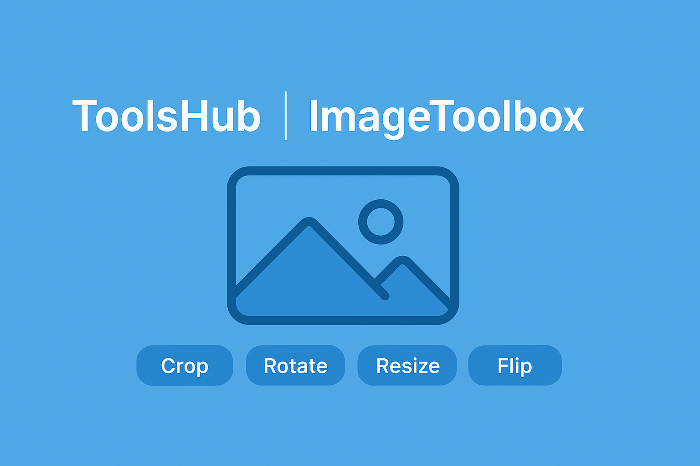

<p align="center">
  
</p>


# 🛠️ ToolsHub: ImageToolbox

An interactive Streamlit-based image manipulation toolbox with a sleek, styled UI. Crop, resize, rotate, flip, adjust brightness/contrast, blur, and convert image formats — all in one smooth interface!

## ✨ Features

- 📷 Image upload (JPEG/PNG)
- ✂️ Crop (drag & select)
- ↔️ Resize, Rotate, Flip
- 🌗 Grayscale Conversion
- 🌈 Brightness & Contrast Adjustment
- 🌀 Blur Effect
- 🔁 Format Converter (PNG ↔ JPEG)
- 💾 Download processed images
- 🎨 Styled UI inspired by Pornhub (but peaceful blues 😌)

> 💅 Code beautified and enhanced by **ChatGPT**

---

## 🚀 Run Locally

Make sure you have Python and install the dependencies:

```bash
pip install streamlit pillow streamlit-cropper
